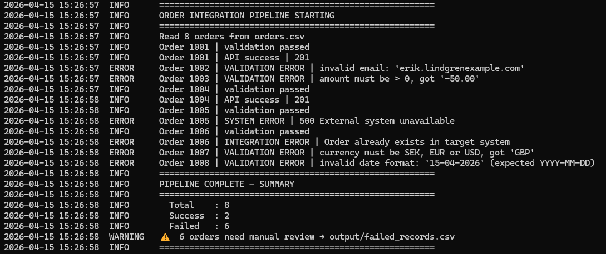
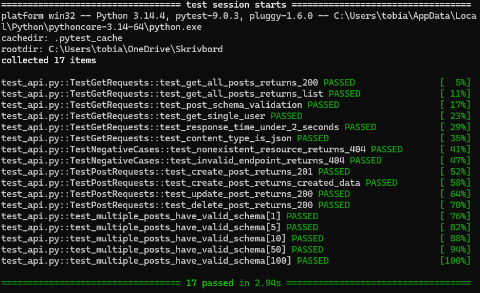
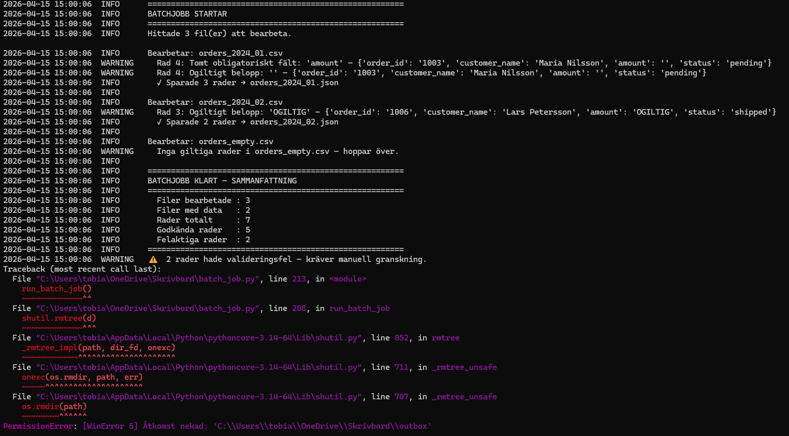
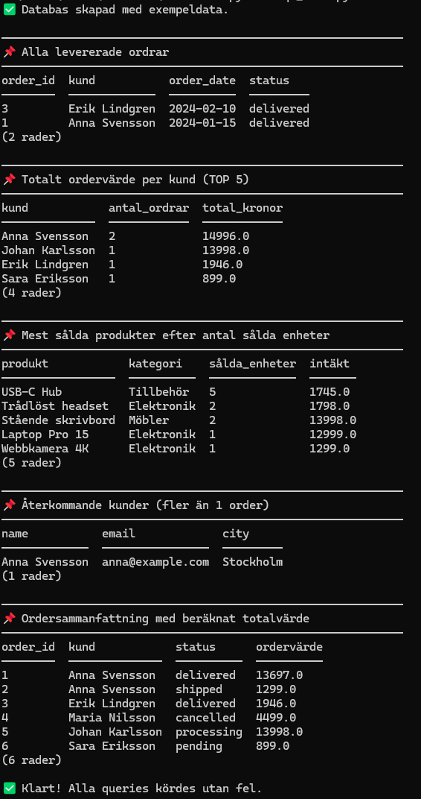
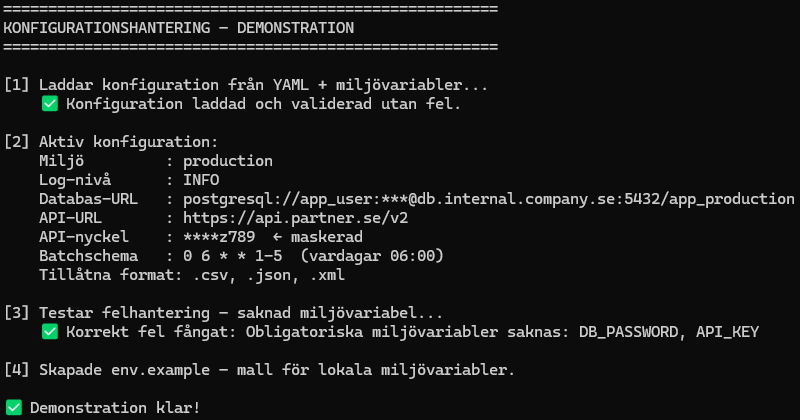

# Technical Portfolio – Application Specialist

This portfolio demonstrates practical skills in API testing, data validation, integration flows and system configuration — built to simulate real-world scenarios relevant for an Application Specialist role.

---

## 📌 Highlights

- End-to-end integration flow (file → validation → API → logging → failed records)
- Automated API testing (17/17 tests passing)
- SQL-based data validation and analysis
- Batch processing with logging and error handling
- Configuration management using YAML and environment variables

---

## 🧠 Why this matters for an Application Specialist

An Application Specialist bridges customers and developers — configuring systems, validating integrations, testing solutions and troubleshooting data flows.

| Project | Skill demonstrated | Why it matters |
|---|---|---|
| Integration Pipeline | End-to-end order flow | Validate data, call APIs, handle failures and ensure traceability |
| API Testing | Automated validation of APIs | Ensure integrations behave correctly before production |
| Batch Processing | File-based automation | Process large datasets and log errors for support |
| SQL Analysis | Data querying and validation | Analyse and debug data issues across systems |
| Config Management | Environment configuration | Manage settings across environments securely |

---

# 🥇 1. End-to-End Order Integration Flow

**Problem:** Incoming order data must be validated, processed and sent to an external system, while handling errors and ensuring traceability.

**Solution:** Built a complete integration pipeline that:
- Reads CSV input
- Validates data (6 rules)
- Sends valid records to an API
- Logs all outcomes
- Separates successful and failed records

**Output:**  
2 successful orders, 6 failures across validation, integration and system errors.

This simulates a real-world integration scenario where data quality, error handling and logging are critical.

### Example pipeline output

---

# 🥈 2. API Testing – Integration Validation

**Problem:** Need to verify that a REST API returns correct data, handles errors and meets performance requirements.

**Solution:** Built automated tests using pytest covering:
- Status codes (200, 404, etc.)
- Schema validation
- Negative test cases
- Response time checks

**Output:**  
17/17 tests passed validating API behaviour across both success and failure scenarios.

This simulates how API integrations are validated before being deployed in production.

### Example test run

---

# 🥉 3. Batch Processing – Data Pipeline

**Problem:** Process incoming data files and handle errors without breaking the entire flow.

**Solution:** Built a batch script that:
- Reads input files
- Validates data
- Transforms records
- Logs errors
- Outputs structured results

**Output:**  
Processed data with logging, error tracking and structured output.

### Example batch output

---

# 4. SQL – Data Analysis

**Problem:** Extract and analyse order data across multiple related tables.

**Solution:** Built a SQLite database and wrote queries using:
- JOIN
- GROUP BY
- Subqueries
- Aggregations

**Output:**  
Insights such as top customers, revenue and product performance.

### Example SQL output

---

# 5. Configuration Management

**Problem:** Manage environment-specific settings securely.

**Solution:** Built a configuration system using:
- YAML files
- Environment variables
- Validation logic

**Output:**  
Structured configuration handling with separation of config and secrets.

### Example config output

---

## 🎯 Summary

This portfolio demonstrates how I:
- Validate and test integrations
- Work with structured data (SQL)
- Build automated data flows
- Handle errors and logging
- Configure systems across environments

The focus has been on building practical, realistic examples rather than isolated code snippets.

---
